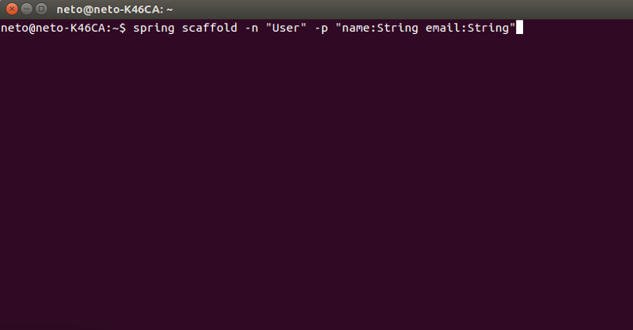

# spring-boot-scaffold

[](https://gitter.im/spring-boot-scaffold-kotlin/Lobby?utm_source=badge&utm_medium=badge&utm_campaign=pr-badge&utm_content=badge)
 [](https://codeship.com/projects/184622)

# Overview
<p align="center">
  
</p>

# About
Generate scaffold with spring boot.

Generate CRUD basic with spring boot.

Scaffold for java web, a clean generate with simple classes.

# Demo 
  * [Video](https://www.youtube.com/watch?v=i6a2RudkELw&t=1s)
  * [Sample](https://github.com/NetoDevel/cli-spring-boot-scaffold/tree/master/sample)
  
# Alert
In development. Help us! Make a fork

Refactoring in 
https://github.com/NetoDevel/generate-core


# Requeriments
         
* Java
* Spring Boot CLI (1.4.1 or higher):

# Install
   [Installing Spring Boot CLI](https://docs.spring.io/spring-boot/docs/current/reference/html/getting-started-installing-spring-boot.html)
 
   ``` 
    $ spring version
    Spring CLI v1.4.1.RELEASE
   ```
And install the Spring Scaffold plugin

    $ git clone https://github.com/NetoDevel/cli-spring-boot-scaffold.git
    $ cd cli-spring-boot-scaffold
    $ mvn install
    $ spring install br.com.netodevel:spring-scaffold-cli:0.0.1-SNAPSHOT


# Usage

    $ spring init --dependencies=web,data-jpa,thymeleaf,mysql --package-name=com.example my-project
    $ cd my-project
    $ spring setup:scaffold
    $ spring scaffold -n "User" -p "name:String email:String"
    $ spring db:create -p "mysql"
    $ mvn spring-boot:run

Default is spring 1.x, edit scaffold.info to change to 2.x before run *spring scaffold*.

# Structure

    __com
        __example
              MainApplication.java
              __model
                  User.java
              __repository
                  UserRepository.java
              __service
                  UserService.java
              __controller
                  UserController.java
     __src/main/resources
            __templates
                 __user
                     form.html
                     index.html
                     show.html
            scaffold.info
            application.properties


| HTTP Status   | Endpoints     | Function       |
| ------------- |:-------------:| -----:         |
| GET           | /users        | list all users |
| GET           | /users/{id}   | show user      |
| POST          | /users        | save user      |
| PUT           | /users        | update user    |
| DELETE        | /users/{id}    | delete user    |


# Documentation

|Commands   |Parameters                                 |Examples
| ------------- |:-------------:                         | -------------:  
| spring model  | -n -p | spring model -n "User" -p "name:String" 
| spring repository  | -n | spring repository -n User
| spring service  | -n | spring service -n User 
| spring controller  | -n | spring controller -n User
| spring scaffold  | -n -p |spring scaffold -n "User" -p "name:String mail:String" |
| spring setup:scaffold| -n -db -u -p | spring  setup:scaffold -n "com.example" -db "dbname" -u "root" -p "root"
| spring db:create  | -p  | spring db:create -p "mysql"


# License

    The MIT License (MIT)

    Copyright (c) SED

    Permission is hereby granted, free of charge, to any person obtaining a 
    copy of this software and associated documentation files (the "Software"), 
    to deal in the Software without restriction, including without limitation 
    the rights to use, copy, modify, merge, publish, distribute, sublicense, 
    and/or sell copies of the Software, and to permit persons to whom the Software is 
    furnished to do so, subject to the following conditions:

    The above copyright notice and this permission notice shall be included 
    in all copies or substantial portions of the Software.

    THE SOFTWARE IS PROVIDED "AS IS", WITHOUT WARRANTY OF ANY KIND, EXPRESS OR IMPLIED, 
    INCLUDING BUT NOT LIMITED TO THE WARRANTIES OF MERCHANTABILITY, FITNESS FOR A PARTICULAR 
    PURPOSE AND NONINFRINGEMENT. IN NO EVENT SHALL THE AUTHORS OR COPYRIGHT HOLDERS BE LIABLE 
    FOR ANY CLAIM, DAMAGES OR OTHER LIABILITY, WHETHER IN AN ACTION OF CONTRACT, TORT OR OTHERWISE,
    ARISING FROM, OUT OF OR IN CONNECTION WITH THE SOFTWARE OR THE USE OR OTHER DEALINGS IN THE SOFTWARE.

### Acknowledgment
         
 * [Bruno Lima](https://github.com/brunodles)
 * [Ivan Marreta](https://github.com/ivanmarreta)
 * [Bruno Barros](https://github.com/brunobarros)
 * [Felipe Adorno](https://github.com/FelipeAdorno)
       
### Create By

 [SED](http://www.sedengenharia.com.br/)
